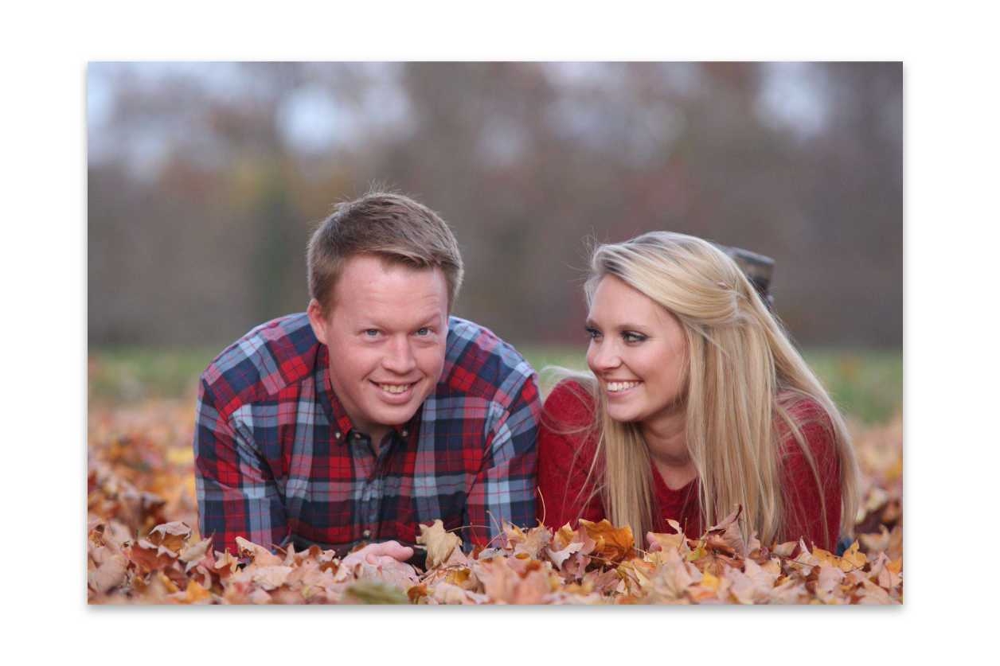

# Bruce & Meghan's Wedding

> Bruce finally popped the big question, and Meghan said yes! That being said, feel free to browse our Wedding Website at [http://www.bruceandmeghan.com](http://www.bruceandmeghan.com). Thanks!

## Getting Started
 To view the source for the theme currently in use on the [website](http://www.bruceandmeghan.com), navigate to the `wp-content/themes/wedding-2015/` directory.
- Install NPM Dependencies: `npm install`
- Install Bower Dependencies: `bower install` (for the first time) or `bower update` (to update)
- Run `gulp` for building the Production-Ready files and `gulp serve` for Development Preview

### Themes
---
#### [Wedding 2015](wp-content/themes/wedding-2015/)
##### Features
Please refer to the [gulpfile.js](wp-content/themes/wedding-2015/gulpfile.js) for up to date information on what's supported.

* CSS Autoprefixing
* Built-in preview server with [BrowserSync](https://github.com/shakyshane/browser-sync)
* Automatically compile Sass using [gulp-ruby-sass](https://github.com/sindresorhus/gulp-ruby-sass)
* Automatically lint your scripts using [gulp-jshint](https://github.com/spenceralger/gulp-jshint)
* Automatically optimize your images using [gulp-imagemin](https://github.com/sindresorhus/gulp-imagemin)
* Automatically wire-up dependencies installed with [Bower](http://bower.io) *(when `gulp serve` or `gulp wiredep`)*

##### Third-Party Dependencies
(HTML, CSS/Sass, JavaScript, Icons, Images, etc.)  

To install dependencies, run `bower install --save package-name` to get the files, then add a `script` or `style` tag to your the appropriate place.

### Configuration
_Content Coming Soon_

### License
[GPL License](http://www.gnu.org/licenses/gpl-2.0.txt)